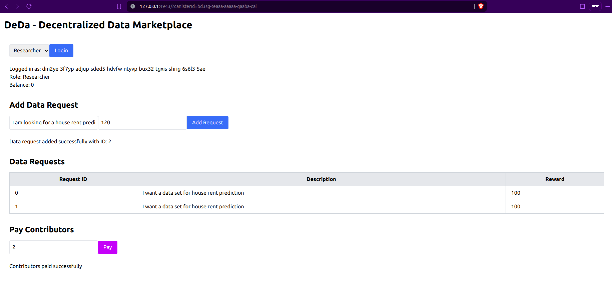
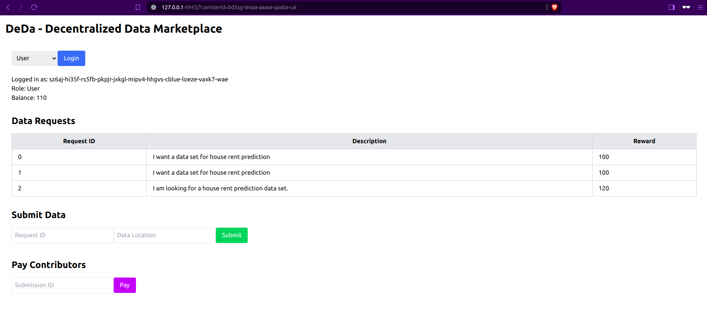
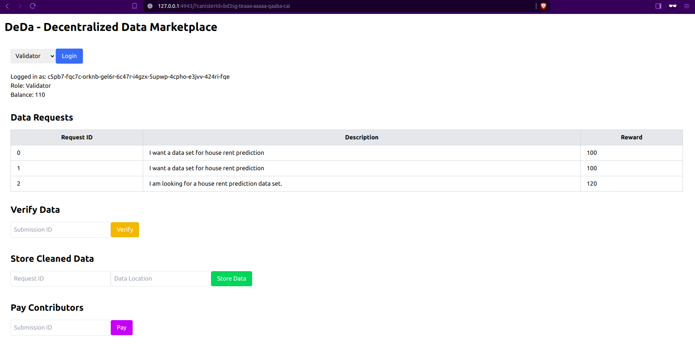

### Project: DEda - Decentralized Data Application

**Problem Statement:**

In the rapidly evolving fields of Artificial Intelligence (AI) and Machine Learning (ML), practitioners often face significant challenges in acquiring high-quality, relevant datasets. These datasets are critical for training models and validating research hypotheses. However, obtaining such data can be time-consuming, costly, and fraught with issues related to data integrity and quality. Additionally, there is often a lack of transparency and fairness in how data contributors and validators are rewarded for their efforts. 

### Solution: DEda - Decentralized Data Application

DEda aims to address these challenges by creating a decentralized data marketplace specifically for AI and ML practitioners. The platform facilitates the seamless exchange of data sets between researchers, data publishers, and validators, ensuring data quality and fair compensation for all participants. By leveraging the capabilities of the Internet Computer (ICP), DEda provides a secure, transparent, and efficient ecosystem for data transactions.

### Key Features and Workflow:

1. **Researcher Requests Data**:
   - A researcher initiates a request for a specific dataset required for their AI/ML project. This request is recorded on the DEda platform, detailing the type of data needed and the reward offered.

2. **User Publishes Data**:
   - A user, who has access to the requested data, sees the researcher's request and submits the data to the platform. This submission includes the data location and other relevant details.

   

3. **Validator Verifies and Cleans Data**:
   - A validator reviews the submitted data, performs necessary checks, and cleans the data to ensure it meets the required standards. This step is crucial for maintaining the integrity and usability of the data.

   

4. **Incentivizing Participants**:
   - Both the data publisher (user) and the validator are incentivized for their contributions. The smart contract ensures that rewards are distributed fairly based on their efforts.

### Technology Stack:

- **Internet Computer (ICP)**: The entire DEda platform, including smart contracts and the frontend, is hosted and operated on the ICP. This provides a decentralized, scalable, and secure infrastructure.
  
- **Smart Contracts in Rust**: The core logic of DEda, such as login/authentication, data request management, data submission, verification, and reward distribution, is implemented using smart contracts written in Rust. Rust is chosen for its performance and safety features, ensuring robust contract execution.

- **Frontend in React and Vite**: The user interface of DEda is developed using React, a popular JavaScript library for building responsive UIs, and Vite, a build tool that offers a fast development server and optimized builds.

- **Internet Identity**: User authentication is handled through Internet Identity, a decentralized identity provider on ICP. This ensures secure and private user logins without relying on centralized authentication services.

### How ICP was Utilized:

- **Hosting and Deployment**: Both the smart contracts and the frontend application are deployed on the Internet Computer, ensuring a decentralized and secure environment.
  
- **Smart Contract Functionality**: Key functionalities such as user login, data requests, data submissions, data verification, and payment distribution are managed through smart contracts written in Rust. These contracts are executed on the ICP, ensuring transparency and reliability.

- **Authentication with Internet Identity**: Internet Identity is used for authenticating users. It provides a seamless and secure way for users to log in and interact with the DEda platform without compromising their privacy.

### ToDo:

- Implement tokens and token transfers for incentivisation

- Integrate ICP storage OR IPFS to store data sets

- Improve the UI and deploy on Mainnet